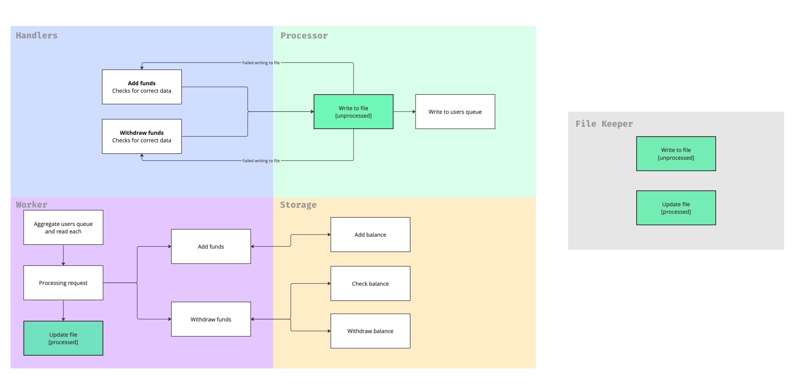

# Persistent transaction service
## Description
Сервис для транзакций.

Сервис может начислять и списывать средства с аккаунта.

Архитектура по сути делится на две половины `handler` -> `action` и `worker` -> `storage`.
Чтобы слои имели меньшее зацепление, все передается через интерфейс слоя.

Первая половина принимает запрос и передает его в очередь пользователя. 
Вторая же половина раз в 500 миллисекунд проходит по всем очередям пользователей, агрегирует 
запросы в одну последовательную очередь и исполняет их, записывая новые данные в базу данных.

Если сервис упадет, все необработанные запросы будут прочитаны заново из файла [.index](test.index) и записаны в очереди.

## Endpoints

Сервис дает только один эндпоинт, на который отправляется запрос на зачисление/списание средств.

- `POST api/balance/`
    - Хэндлер для манипуляций балансом.
    - Принимает JSON с описанием запроса
    - Параметр `operation` принимает только значения `add` или `withdraw`, 
  иначе не пройдет проверку и выдаст http статус `422 StatusUnprocessableEntity` 
  
```json
{
    "account": "user",
    "operation": "add",
    "amount": 37.37
}
```

## Deploy

Все параметры сервиса и базы данных берутся из переменных окружения.  
Окружение задается файлом [.env](.env).

Примерные curl запросы можно взять из [файла](http-calls.sh). Есть запросы на все имеющиеся эндпоинты.  

Запустить контейнеры с сервисом и с базой данных можно командой:
```sh 
$ make compose
```

Остановка контейнеров:
```sh
$ make compose-down
```

Для того чтобы запустить приложение не используя Docker, необходимо подтянуть зависимости и запустить с флагами:
```sh
$ go run cmd/main.go -a <port> -d <postgres URI> -f <path to file>
```
Без флага `-a` запустится на порте `:8080`. 
Также эти параметры можно задать через переменные окружения: `RUN_ADDRESS`, `DATABASE_URI` и `INDEX_STORAGE`.

## Обоснование архитектуры и остальные фичи

Все части сервиса заменяемы благодаря архитектуре.   
Каждая часть просто должна подходить под нужный [интерфейс](/internal/interfaces/interfaces.go).

Таким образом была максимально уменьшена связность компонентов в системе.

### Хэш данных как ID запроса
ID запроса генерируется из данных запроса:
```go
// OperationHash returns short hash string
func OperationHash(account, operation, date string) string {
	coupled := fmt.Sprintf("%s%s%s", account, operation, date)
	hsha := sha1.Sum([]byte(coupled))

	return hex.EncodeToString(hsha[:5])
}
```

Сделано это для того, чтобы после записи в базу найти запрос в файле [.index](test.index) 
и отметить его как обработанный. Например, при инкрементальной системе id нужно было бы читать 
инкремент из файла и увеличивать его, при системе рандомных ID можно наткнуться на коллизию.


## Схемы логики и структуры сервиса:
Перед выполнением спроектировал систему и продумал большинство моментов 




## Схема хранения данных (ERD):

